## OQuaRE model value
Represents the quality of the ontology when taking in all the values obtained after evaluation across the latest 20 versions.On a scale of 1 to 5, 5 represents the highest quality attainable according to the OQuaRE framework

## OQuaRE category values
Each category has a value on a scale of 1 to 5, indicating how good the ontology is for each category

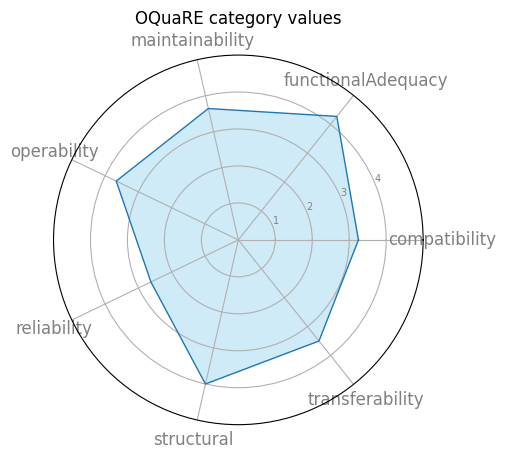
## OQuaRE category evolution
Evolution of each category overtime on a scale of 1 to 5

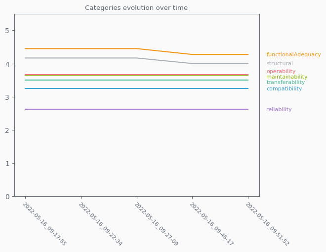
## OQuaRE subcategories metrics
Each category has a set of subcategories with metrics on a scale of 1 to 5, which makes up the category end value

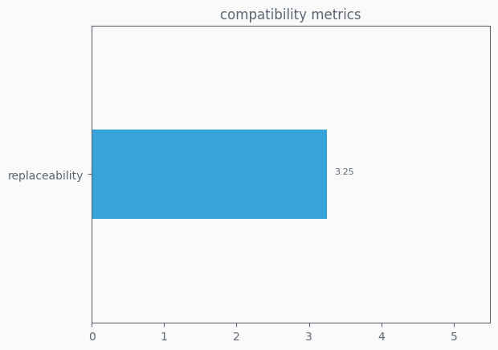

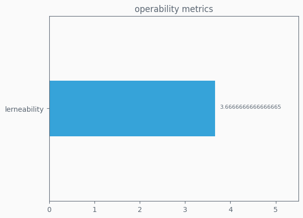
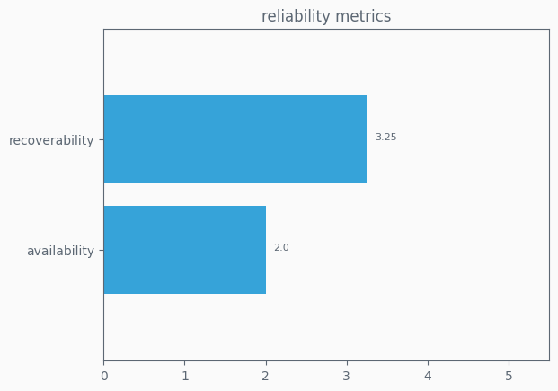
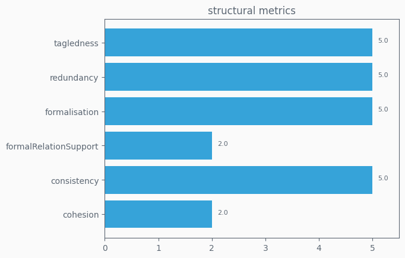

## OQuaRE subcategories metrics evolution
Evolution of each category subcategories values overtime on a scale of 1 to 5

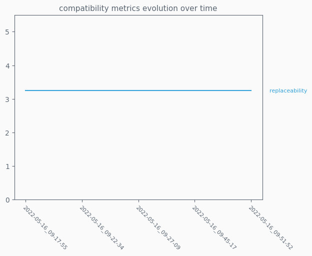
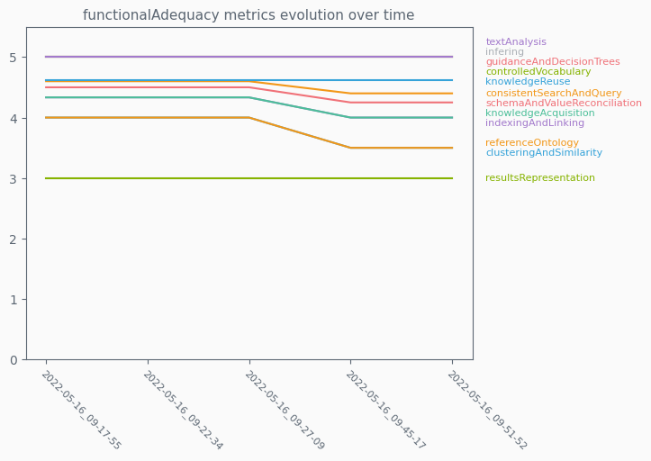

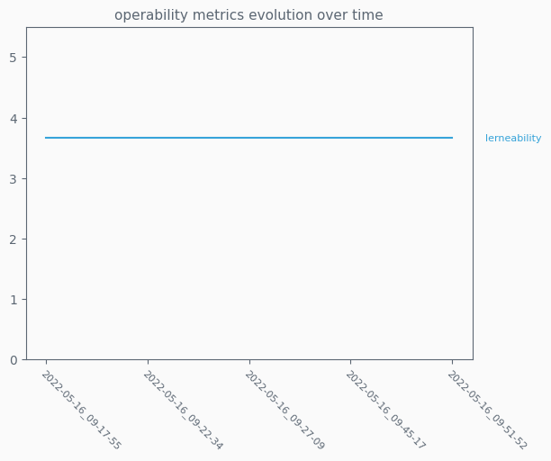

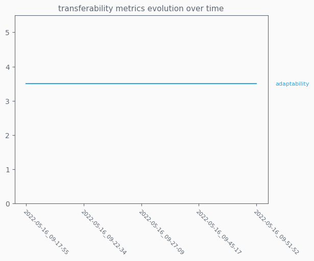
## OQuaRE metrics values
Fine grained metrics, lowest level of ontology analysis provided. Scaled version uses a 1 to 5 scale

## OQuaRE metrics evolution
Evolution of each of the 19 metrics obtained from an ontology
### ANOnto evolution

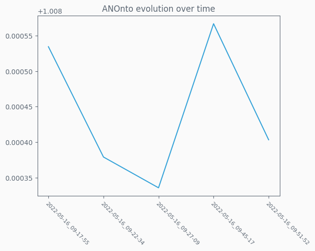

### AROnto evolution

### CBOOnto evolution

### CBOnto2 evolution

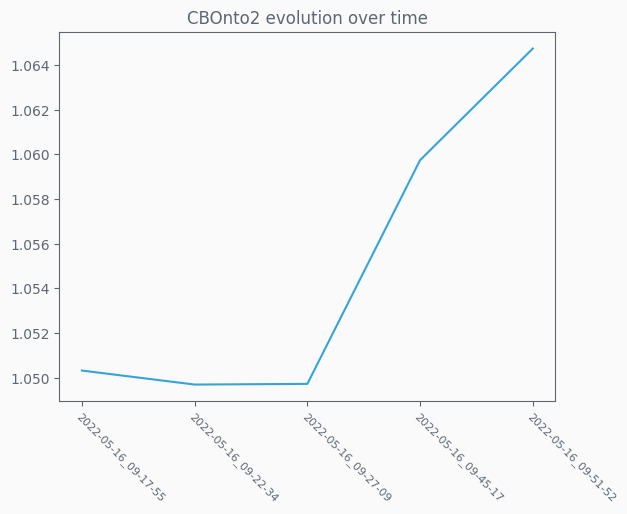

### CROnto evolution

### DITOnto evolution

### INROnto evolution

### LCOMOnto evolution

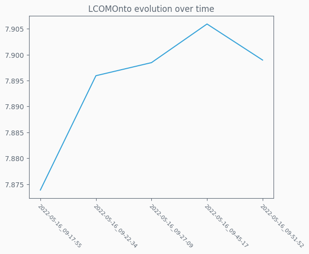

### NACOnto evolution

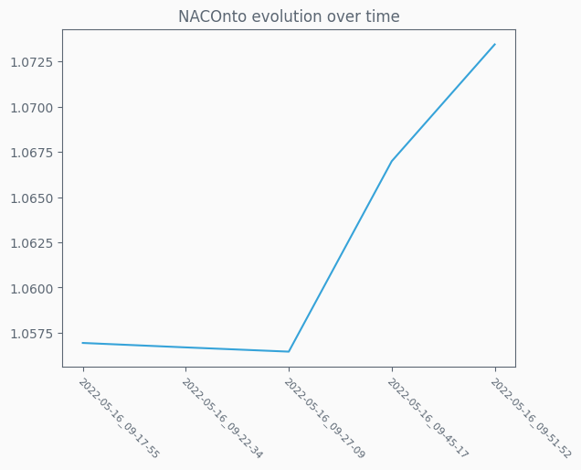

### NOCOnto evolution

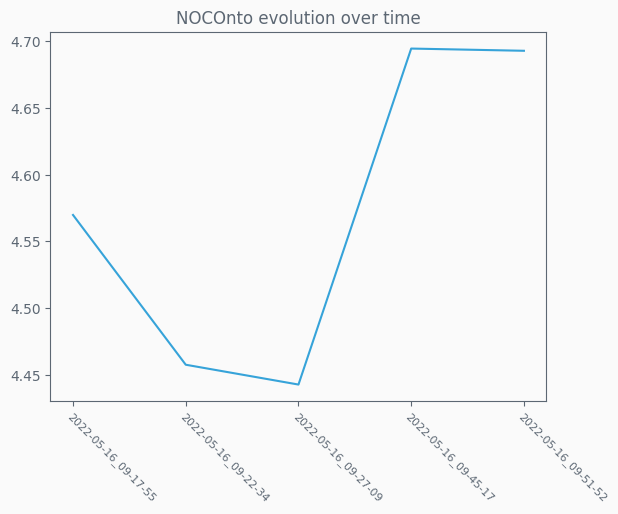

### NOMOnto evolution

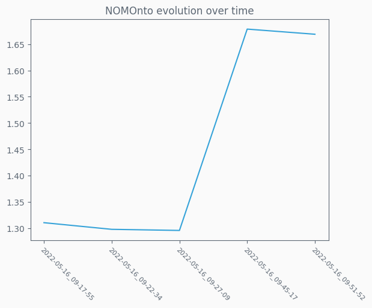

### POnto evolution

### PROnto evolution

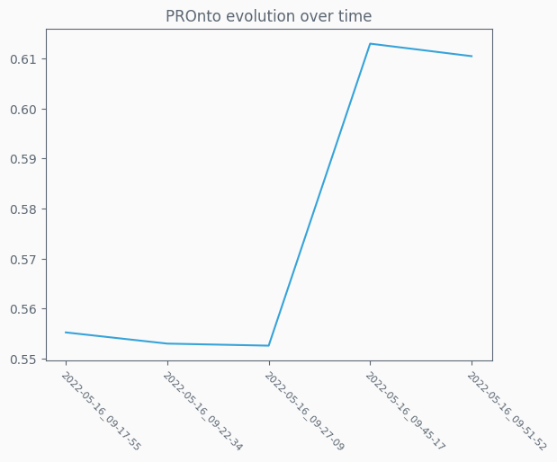

### RFCOnto evolution

### RROnto evolution

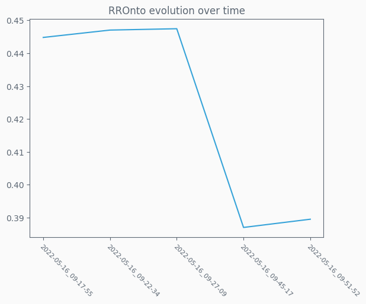

### TMOnto evolution

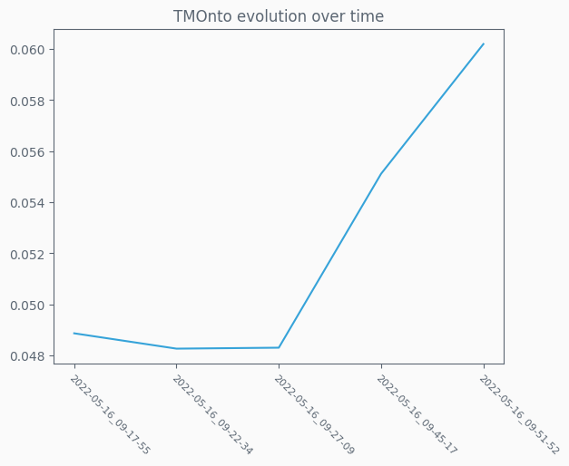

### TMOnto2 evolution

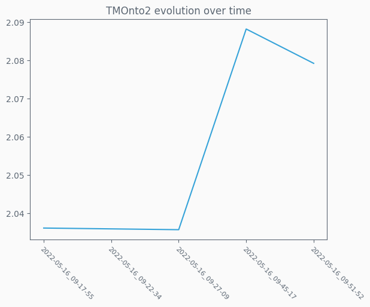

### WMCOnto evolution

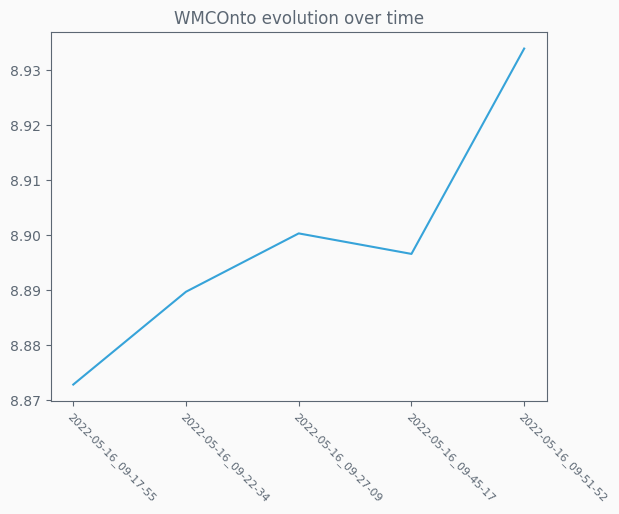

### WMCOnto2 evolution

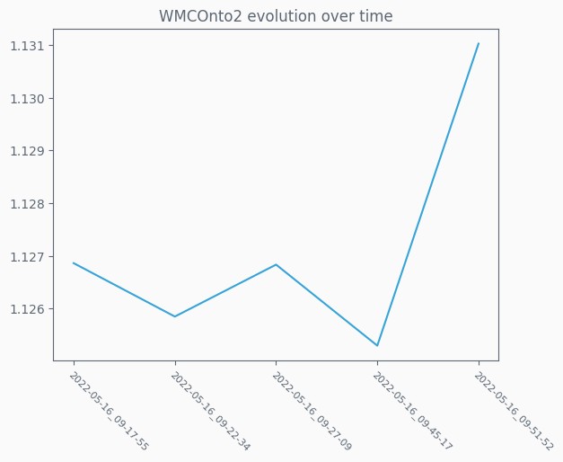

